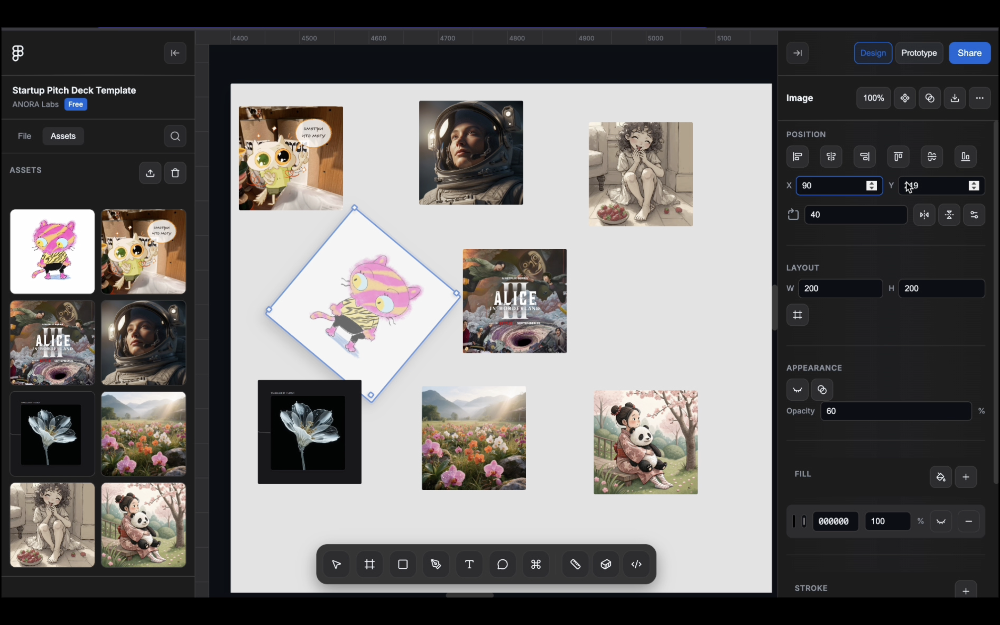
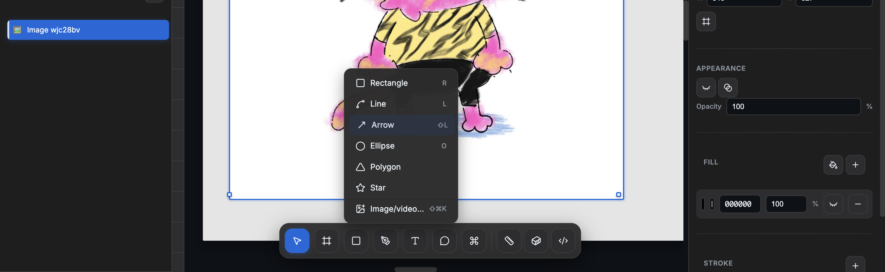
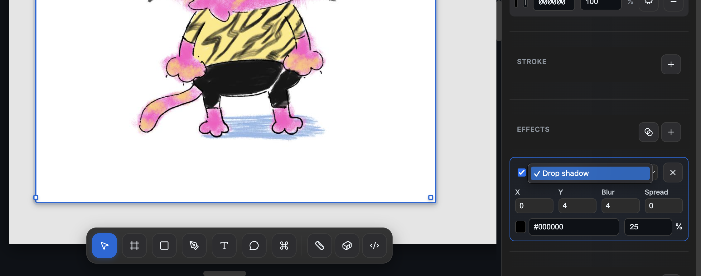
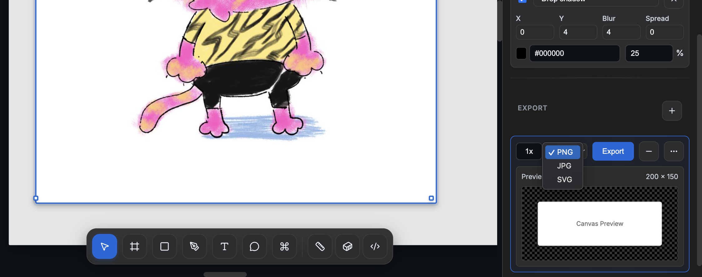
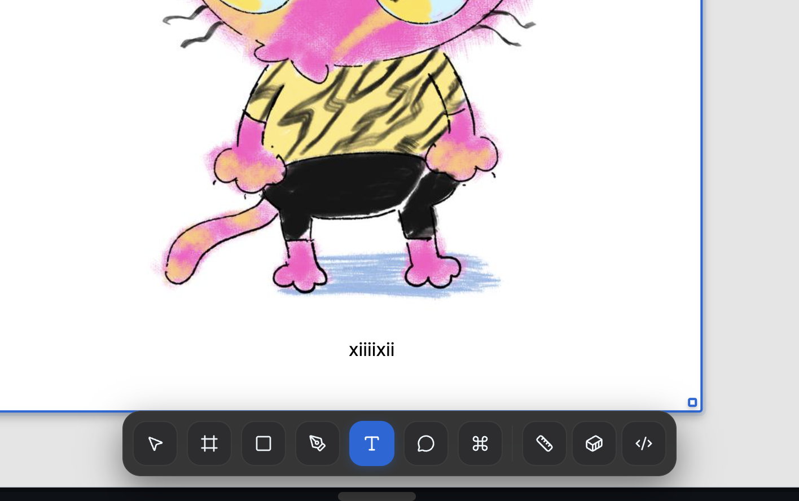
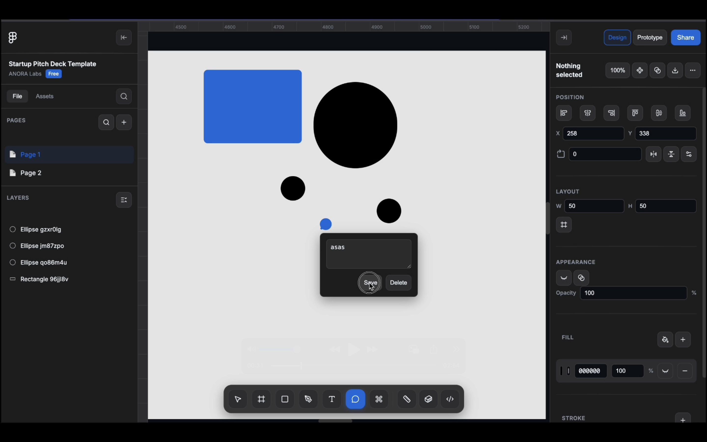
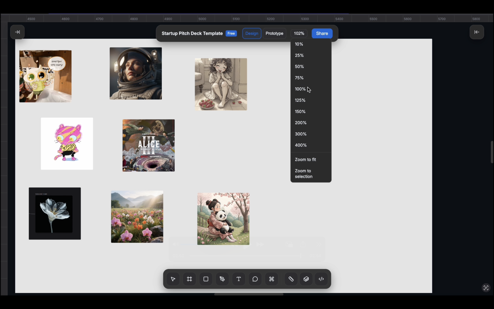

# Figma Clone - Professional Design Tool

A fully functional Figma clone built with vanilla HTML, CSS, and JavaScript. This application replicates Figma's core design functionality including shape creation, text editing, effects, export capabilities, and more.

## 🎯 Features

### Core Design Tools
- **Shape Creation**: Rectangle, Ellipse, Line, Arrow, Polygon, Star, Path/Pen Tool
- **Text Tool**: Fully editable text with live typing and in-place editing
- **Image Support**: Drag & drop, paste from clipboard, file picker, assets gallery
- **Comments**: Clickable comment system with position persistence
- **Selection Tools**: Multi-selection with Shift+click, move, resize with corner handles

### Advanced Functionality
- **Multi-Selection**: Hold Shift and click to select multiple elements simultaneously
- **Alignment Tools**: Comprehensive alignment options for multiple selected elements
  - Horizontal: Left, Center, Right alignment
  - Vertical: Top, Center, Bottom alignment
- **Transform Tools**: Flip horizontal/vertical with visual transforms
- **Stroke System**: Complete stroke management with color, width, and visibility controls
- **Effects System**: Drop shadows with full control (X, Y, Blur, Spread, Color, Opacity)
- **Export System**: PNG export with real-time preview and canvas rendering
- **Infinite Canvas**: Smooth pan and zoom in all directions
- **Advanced Zoom**: Comprehensive zoom controls with preset values (10%-400%)
  - Zoom to fit all content
  - Zoom to selection
  - Dropdown with common zoom levels
- **Pages Management**: Multiple design pages with switching and deletion
- **Assets Gallery**: Dedicated image library with upload, preview, and reuse functionality
- **Dynamic Search**: Real-time search with highlighting and focusing on canvas elements

### Professional UI/UX
- **Clean Header Design**: Minimalist top area with only rulers when sidebars are open
- **Reorganized Controls**: Design/Prototype/Zoom/Share moved to right sidebar for cleaner workflow
- **Project Title Section**: Dedicated area below Figma icon for better organization
- **Figma-Accurate Design**: Pixel-perfect recreation of Figma's interface
- **Dark Theme**: Professional dark color scheme
- **Lucide Icons**: High-quality SVG icons throughout
- **Smooth Animations**: Polished transitions and micro-interactions
- **Glass Morphism**: Modern backdrop blur effects
- **Responsive Design**: Adaptive layout with collapsible sidebars and floating controls

## 📸 Screenshots

<!-- Add your screenshots here -->

### Main Interface


### Shape Tools


### Effects Panel


### Export Feature


### Text Editing


### Comments System


### Collapsed Sidebars


## 🚀 Getting Started

### Prerequisites
- Modern web browser (Chrome, Firefox, Safari, Edge)
- No server required - runs entirely in the browser

### Installation
1. Clone or download this repository
2. Open `index.html` in your web browser
3. Start designing immediately!

```bash
# Clone the repository
git clone [repository-url]

# Navigate to the project
cd figma-clone

# Open in browser
open index.html
```

## 🎨 How to Use

### Basic Tools
- **Select Tool (V)**: Click to select shapes, drag to move
- **Hand Tool (H)**: Pan around the canvas
- **Rectangle (R)**: Click and drag to create rectangles
- **Ellipse (O)**: Click and drag to create circles/ellipses
- **Line (L)**: Click and drag to create lines
- **Text (T)**: Click to create editable text
- **Comment**: Click to place comments

### Shape Manipulation
- **Move**: Select and drag shapes, or use Shift+click for multi-selection
- **Resize**: Drag corner handles to resize selected shapes
- **Properties**: Use right sidebar to adjust X, Y, Width, Height
- **Styling**: Change fill color, stroke (width, color, visibility), opacity, rotation
- **Transform**: Use flip horizontal/vertical buttons in inspector
- **Alignment**: Use alignment tools for precise positioning of multiple elements
- **Effects**: Add drop shadows with full control

### Advanced Features
- **Multi-Selection**: Hold Shift and click to select multiple elements
- **Alignment**: Select multiple elements and use alignment buttons
- **Transform**: Use flip controls to mirror elements horizontally or vertically
- **Stroke Management**: Add, customize, and toggle stroke visibility
- **Effects**: Click + in Effects panel to add drop shadows
- **Export**: Click + in Export panel to export as PNG
- **Images**: Drag & drop images, use image tool, or browse assets gallery
- **Comments**: Click comment tool, then click on canvas
- **Zoom**: Comprehensive zoom controls with presets (10%-400%)
- **Pages**: Create multiple design pages and switch between them
- **Assets**: Upload and manage images in dedicated assets gallery
- **Search**: Real-time search with dynamic highlighting and focusing

## ⌨️ Keyboard Shortcuts

### Tools
- `V` - Select tool
- `H` - Hand tool
- `R` - Rectangle
- `O` - Ellipse
- `L` - Line
- `T` - Text
- `P` - Pen
- `F` - Frame

### Actions
- `Cmd/Ctrl + K` or `/` - Open command palette
- `Shift + Click` - Multi-select elements
- `Delete/Backspace` - Delete selected shapes
- `Cmd/Ctrl + +` - Zoom in
- `Cmd/Ctrl + -` - Zoom out
- `Cmd/Ctrl + 0` - Reset zoom to 100%
- `Escape` - Clear selection or close dialogs

### New Features
- **Zoom to Fit** - Available in zoom dropdown
- **Zoom to Selection** - Available in zoom dropdown  
- **Alignment Tools** - Use buttons in right sidebar Position section
- **Flip Tools** - Use buttons in right sidebar Transform section
- **Stroke Controls** - Add/remove/customize in right sidebar Stroke section
- **Assets Gallery** - Switch to Assets tab in left sidebar
- **Dynamic Search** - Click search icon in left sidebar Pages section

## 🏗️ Technical Architecture

### File Structure
```
figma-clone/
├── index.html          # Main HTML structure
├── styles.css          # All styling and animations
├── app.js              # Core application logic
├── README.md           # This file
└── screenshots/        # Screenshot assets
```

### Core Technologies
- **HTML5**: Semantic structure and canvas management
- **CSS3**: Advanced styling, animations, grid layout
- **Vanilla JavaScript**: Full application logic without frameworks
- **LocalStorage**: Data persistence between sessions
- **HTML5 Canvas**: Image export functionality

### Key Components

#### State Management
```javascript
this.state = {
  tool: 'select',           // Current active tool
  zoom: 1,                  // Canvas zoom level (0.1 to 4.0)
  shapes: [],               // All shapes on canvas
  comments: [],             // All comments  
  selectedIds: new Set(),   // Currently selected shapes (multi-selection)
  pages: [],                // Multiple design pages
  currentPageId: null,      // Active page identifier
  assets: [],               // Image assets gallery
  activeTab: 'file',        // Active sidebar tab (file/assets)
  leftSidebarCollapsed: false,
  rightSidebarCollapsed: false,
  // ... more state
}
```

#### Shape System
- Unified shape rendering system
- SVG generation for complex shapes (arrows, polygons, stars)
- Dynamic property binding
- Effect application with CSS filters

#### Effects System
- Real-time drop shadow preview
- Customizable X, Y, blur, spread, color, opacity
- Multiple effects per shape
- CSS filter-based implementation

## 🎛️ Component Breakdown

### Left Sidebar
- **Figma Icon**: Clean, minimal branding
- **Project Title**: Dedicated section below icon with project name and metadata
- **File Tab**: 
  - **Pages**: Project page management with search functionality
  - **Layers**: Hierarchical shape listing with icons and visibility controls
- **Assets Tab**: 
  - **Image Gallery**: Upload, preview, and reuse images
  - **Asset Management**: Organized library with delete and clear functions

### Main Canvas
- **Infinite Scroll**: 10000x10000px virtual canvas
- **Zoom System**: Smooth scaling with rulers
- **Shape Rendering**: Real-time shape updates
- **Selection System**: Multi-shape selection with handles

### Right Sidebar (Inspector)
- **Top Controls**: Design/Prototype mode switch, zoom controls, Share button
- **Position**: X, Y coordinates with 6 alignment tools (left, center-h, right, top, center-v, bottom)
- **Layout**: Width, height, constraints controls
- **Transform**: Rotation controls with flip horizontal/vertical buttons
- **Appearance**: Opacity, corner radius, visibility toggles
- **Fill**: Color picker with hex input and opacity control
- **Stroke**: Complete stroke management (add, color, width, visibility, remove)
- **Effects**: Drop shadow configuration with full controls
- **Export**: PNG export with real-time preview

### Bottom Toolbar
- **Tool Groups**: Organized tool categories
- **Dropdowns**: Nested tool selection
- **View Controls**: Rulers, zoom, developer mode

## 💾 Data Persistence

All data is automatically saved to browser localStorage:

```javascript
// Saved data structure
{
  shapes: [
    {
      id: "unique-id",
      type: "rectangle",
      x: 100, y: 100,
      w: 200, h: 150,
      fill: "#0969da",
      effects: [...],
      // ... other properties
    }
  ],
  comments: [
    {
      id: "comment-id",
      x: 300, y: 200,
      text: "Design feedback",
      timestamp: "2023-..."
    }
  ],
  timestamp: "2023-..."
}
```

## 🎨 Styling System

### CSS Variables
```css
:root {
  --bg-0: #1e1e1e;           /* Primary background */
  --bg-1: #2d2d2d;           /* Secondary background */
  --text: #ffffff;           /* Primary text */
  --accent: #0969da;         /* Brand accent */
  --border: #3c3c3c;         /* Border color */
  --shadow: 0 4px 12px rgba(0,0,0,0.15);
}
```

### Animation System
- Smooth transitions with `cubic-bezier` easing
- Transform-based animations for performance
- Backdrop blur for modern glass effects
- Micro-interactions on hover states

## 🔧 Customization

### Adding New Shapes
1. Add shape type to tool creation logic
2. Implement rendering in `renderShape()` method
3. Add SVG generation method if needed
4. Update layer icons in `getShapeIcon()`

### Adding New Effects
1. Extend effects system in `addEffect()` method
2. Add UI controls in `createEffectElement()`
3. Implement CSS filter in `applyEffects()`
4. Update export canvas rendering

### Styling Modifications
- Modify CSS variables for theme changes
- Update component-specific styles
- Maintain responsive breakpoints
- Preserve animation timing

## 📱 Browser Compatibility

- ✅ Chrome 90+
- ✅ Firefox 88+
- ✅ Safari 14+
- ✅ Edge 90+

### Required Features
- CSS Grid Layout
- CSS Custom Properties
- HTML5 Canvas
- LocalStorage API
- File API (for image uploads)
- Clipboard API (for image paste)

## 🚀 Performance

### Optimizations
- **Efficient Rendering**: Only re-render changed shapes
- **Event Delegation**: Minimal event listeners
- **LocalStorage**: Chunked data saving
- **CSS Transforms**: Hardware-accelerated animations
- **Debounced Saving**: Reduced localStorage writes

### Memory Management
- Automatic cleanup of removed elements
- Efficient shape data structures
- Optimized image handling with base64

## 🔮 Future Enhancements

### Potential Features
- [ ] More shape types (pentagon, octagon, custom polygons)
- [ ] Layer groups and nesting
- [ ] Copy/paste functionality
- [ ] Undo/redo system
- [ ] Grid and snap-to-grid
- [ ] Collaborative features
- [ ] Component system
- [ ] More export formats (SVG, PDF)
- [ ] Advanced text formatting
- [ ] Gradient fills
- [ ] More effects (blur, glow, etc.)

## 🐛 Known Issues

- Text selection may interfere with shape selection
- Large images may impact performance
- Complex shapes with many effects may slow rendering
- LocalStorage has size limitations (~5-10MB)

## 🤝 Contributing

This is a learning project demonstrating vanilla JavaScript capabilities. Feel free to:

1. Fork the repository
2. Create feature branches
3. Submit pull requests
4. Report issues
5. Suggest improvements

## 📄 License

This project is open source and available under the [MIT License](LICENSE).

## 🙏 Acknowledgments

- **Figma**: For the original design inspiration
- **Lucide Icons**: For the beautiful icon set
- **Inter Font**: For the professional typography
- **CSS-Tricks**: For various CSS techniques
- **MDN Web Docs**: For comprehensive web API documentation

---

**Built with ❤️ using vanilla HTML, CSS, and JavaScript**

*A demonstration of what's possible without frameworks*
